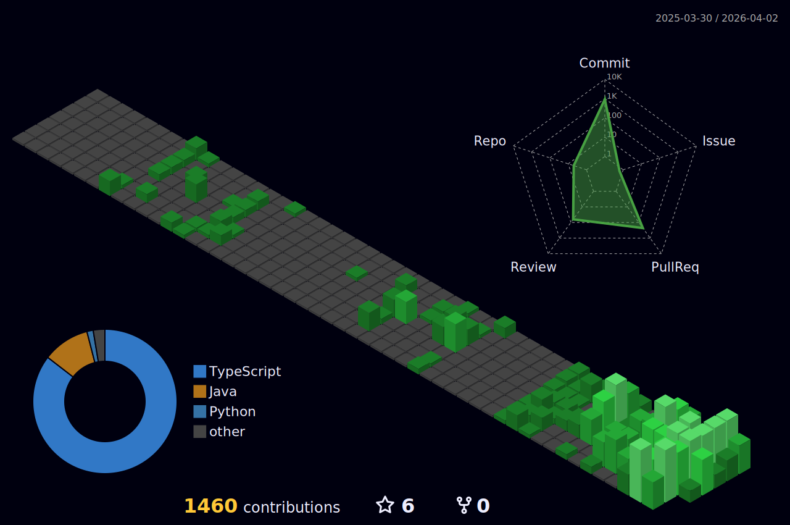

  

  <h1>🌐 Socials</h1>
  
  
  

  <h1>💻 Tech Stack</h1>

  <!-- Backend Languages -->
  
  
  

   

  <!-- Backend Frameworks -->
  
  

   

  <!-- Database -->
  
  
  
  

   

  <!-- DevOps / Tools -->
  
  
  
  
  
  

    

  

    

  
   
  
   
  

